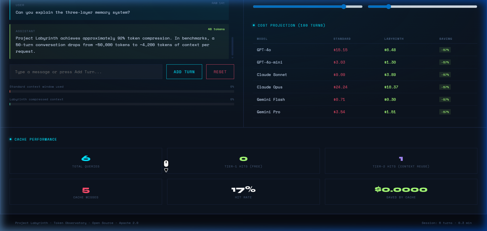
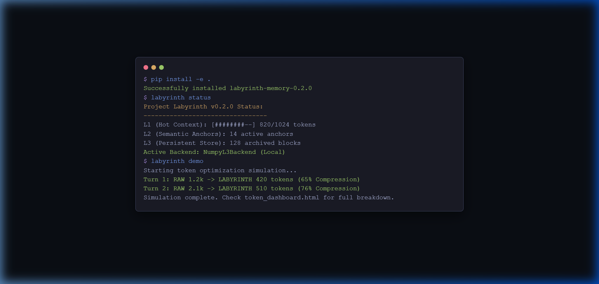

# Project Labyrinth
> Breaking the quadratic memory barrier for autonomous LLM agents.

Project Labyrinth achieves constant-time / linear cost context windows for large conversations using **Recursive Semantic Anchoring** and a **Delta Update Protocol**. 

## V2 Updates
- **Pluggable L3 Backends**: Native `NumpyL3Backend` built-in, no longer requires ChromaDB. Tested across **all new Python releases (including Python 3.14)**.
- **Semantic Answer Cache**: Tiered answer caching directly avoids redundant LLM inferences entirely. 
- **Production-ready CLI**: Instant verification directly via the simple `labyrinth` CLI.

## Quick Start

You can install `labyrinth-memory` to experiment without needing any external dependencies.

```bash
pip install labyrinth-memory
```

Test it immediately on your machine:

```bash
# View active backend and Python environments seamlessly:
labyrinth status

# Run a self-contained token-compression simulation demo 
# and see live USD/token savings for a 10-turn dialogue
labyrinth demo 

# Compress your own local files
labyrinth compress my_code.py
```

## Video Demo & Tutorial

### Dashboard Overview
[](docs/assets/dashboard_demo.webp)
*Visualizing the Recursive Semantic Anchoring flow (L1 → L2 → L3) and real-time cost savings. **[Click here to watch the full animated demo.](docs/assets/dashboard_demo.webp)***

### CLI Interaction
[](docs/assets/cli_demo.webp)
*Fast, optimized context management directly from your terminal. **[Click here to watch the full animated demo.](docs/assets/cli_demo.webp)***

## Multi-LLM Integration

Project Labyrinth is provider-agnostic. Integrating it into your existing AI stack takes only a few lines of code.

### OpenAI
```python
result, messages = proxy.ask(query)
if result.is_semantic_hit:
    response = result.answer
else:
    res = openai.chat.completions.create(model="gpt-4o", messages=messages)
    response = res.choices[0].message.content
    proxy.push_assistant(response)
    proxy.store_answer(query, response)
```

### Anthropic Claude
```python
# Pass Labyrinth's system prompt to Claude's top-level parameter
result, messages = proxy.ask(query)
response = anthropic_client.messages.create(
    model="claude-3-5-sonnet-20240620",
    system=messages[0]["content"], # Labyrinth context
    messages=[m for m in messages if m["role"] != "system"] + [{"role": "user", "content": query}]
)
```

### Google Gemini
```python
result, messages = proxy.ask(query)
model = genai.GenerativeModel('gemini-1.5-pro')
# Labyrinth manages the history compression for Gemini's content parts
response = model.generate_content(str(messages) + query)
```

See the full scripts in the [examples/](examples/) directory for production-ready implementations:
- [openai_integration.py](examples/openai_integration.py)
- [claude_integration.py](examples/claude_integration.py)
- [gemini_integration.py](examples/gemini_integration.py)

## Development
```bash
git clone https://github.com/JIRA4887/project-labyrinth.git
cd project-labyrinth
pip install -e .[dev,chroma]
labyrinth benchmark
```
